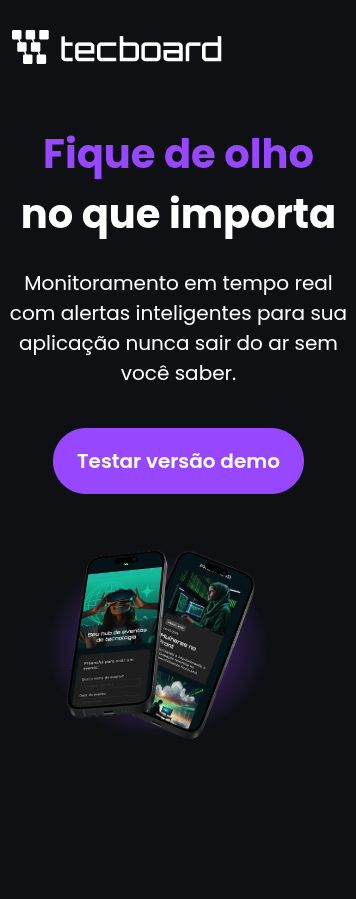

# 🌐 Tecboard — HTML & CSS Fundamentals

Este projeto foi desenvolvido com o objetivo de **praticar os fundamentos de HTML e CSS**, criando uma **página de apresentação do aplicativo Tecboard**, uma ferramenta fictícia para monitoramento de aplicações em tempo real.

---

## 🎯 Objetivo do Projeto

O foco principal deste projeto é consolidar o aprendizado de **estruturação semântica em HTML5** e **estilização responsiva com CSS3**, aplicando boas práticas como:

- Uso de **fontes personalizadas** via `@font-face`;
- Criação de um **layout centralizado e responsivo** (desktop, tablet e mobile);
- Aplicação de **design limpo e moderno** com contraste e tipografia consistente;
- Implementação de **hover effects** e **boas práticas de acessibilidade** (atributos `alt`, `title`, etc).

---

## 🧱 Estrutura do Projeto

tecboard_html_css_fundamentals/  
├── index.html  
├── favicon-tecboard-roxo.png  
├── css/  
│ ├── styles.css  
├── fonts/  
│ ├── Poppins-Regular.ttf  
│ ├── Poppins-SemiBold.ttf  
│ ├── Poppins-Bold.ttf  
├── img/  
│ ├── logo-tecboard-branco.png  
│ ├── celulares-sobrepostos-desktop.png  
│ ├── captura-tecboard-desktop.png  
├── README.md  


---

## 💻 Tecnologias Utilizadas

- **HTML5** — Estruturação semântica e acessível;
- **CSS3** — Estilização, layout responsivo e fontes customizadas;
- **@font-face** — Importação manual das variações da fonte *Poppins*;
- **Media Queries** — Adaptação da interface para diferentes resoluções:
  - 💻 **Desktop** — até 1920px  
  - 📱 **Tablet** — até 768px  
  - 📲 **Mobile** — até 375px  

---

## 🧩 Principais Recursos

- Design minimalista e centrado no conteúdo;  
- Layout fluido com **máximo de 792px** para boa legibilidade;  
- **Botão interativo** com hover (`a:hover` muda o tom de roxo);  
- Tipografia clara e moderna usando a família **Poppins**;  
- Imagens otimizadas e organizadas por contexto.

---

## 📸 Prévia do Projeto

Você pode visualizar o projeto hospedado no GitHub Pages:

👉 **[Acesse aqui](https://igorjosiel.github.io/tecboard_html_css_fundamentals/)**

### Desktop


### Mobile


---

## ⚙️ Como Executar Localmente

1. Clone este repositório:
   ```bash
   git clone https://github.com/igorjosiel/tecboard_html_css_fundamentals.git
2. Acesse a pasta do projeto:
   ```bash
   cd tecboard_html_css_fundamentals

3. Abra o arquivo index.html no navegador.

## ⚙️ Links Úteis

### HTML e CSS
https://www.w3schools.com/html  
https://www.w3schools.com/css  

### Banco de imagens
https://unsplash.com/pt-br  
https://www.pexels.com/pt-br  

### Ferramentas para compressão de imagens
https://www.gimp.org  
https://tinypng.com  